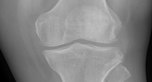
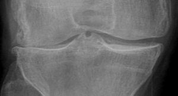

# Osteoarthritis Classification

## Osteoarthritis
Osteoarthritis, commonly known as wear-and-tear arthritis, is a condition in which the natural cushioning between joints -- cartilage -- wears away. When this happens, the bones of the joints rub more closely against one another with less of the shock-absorbing benefits of cartilage. The rubbing results in pain, swelling, stiffness, decreased ability to move, and sometimes the formation of bone spurs. An orthopaedist is a medical doctor specializing in diagnosing and treating disorders, distinguishes between a healthy person and a person with Osteoarthritis by looking at their knee X-ray images.


<h3>Healthy Knee Joint</h3></img>

<br><br>
<h3>Osteoarthritis</h3></img>

 
## About Dataset - 

### Dataset Description

The Dataset contains three folders  
1. Test (845 images)
2. Train (2350 images)
3. Valid (641 images)

Each of these folders has two folders  
1. Normal
2. Osteoarthritis

Click <a href="Osteoarthritis_Dataset">here<a> to download the dataset.

## Content
**Osteoarthritis Classification** 

In this project, we have created a deep learning model that can provide the probability of having osteoarthritis for a given knee X-ray image using inceptionV3(GoogleNet) architecture.

## Project Notebook

You can install Jupyter Notebook Environment from [here](https://jupyter.org/install) or through the [Anaconda Distribution](https://www.anaconda.com/products/distribution) or, can even use any IDE you like.

You can access the **Project Notebook** from <a href="Osteoarthritis Classification.ipynb">here<a>.

## Code Snippet
```python
from tensorflow.keras import optimizers
# using small learning rate becoz we want to fine tune our model
model.compile(loss='binary_crossentropy',
              optimizer=optimizers.RMSprop(learning_rate=2e-5),
              metrics=['acc'])
```

## Support My Work :wink:
You can feel free to comment on my projects, find the bugs :mag_right: or tell me what your thoughts about my coding, analysis and insight. You can also take some codes away if you think some of them can be useful for your projects :computer:. 
If you liked what you saw :blush:, want to have a chat with me about the portfolio, work opportunities, or collaboration, shoot :gun: an email at djjain844@gmail.com.

You can check out my portfolio here :v:.